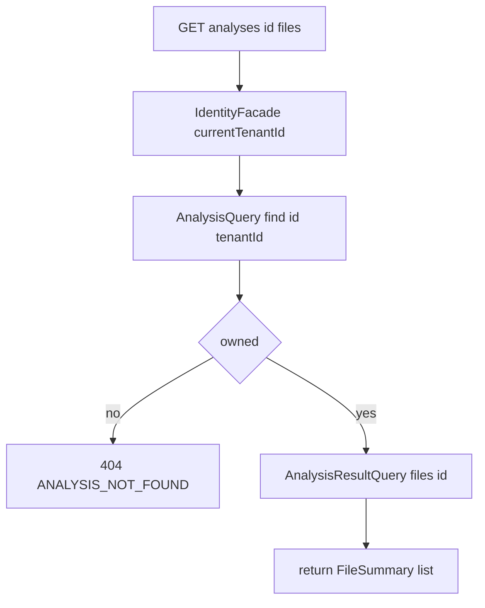

# Chronicle Module — Design & Node Logic (`chronicle.md`)

> Design record for the **Chronicle** module — the dashboard read/presentation layer. Covers **purpose**, **why it owns no data**, the **endpoints**, **tenant scoping**, and **testing**. Code is authoritative.

---

## 1. Purpose

Chronicle answers: *what does the UI need to render an analysis?* It's a thin **aggregator** — it owns **no tables**. It joins other modules' read APIs into the exact shapes the browser wants:

```
conductor :: api  (AnalysisQuery)        -> ownership check + status/score + history
prism :: api      (AnalysisResultQuery)  -> files, source, findings
identity :: api   (IdentityFacade)       -> the calling tenant
```

Keeping reads here lets Conductor stay focused on orchestration and Prism on analysis, while the browser talks to **one** coherent dashboard surface. `allowedDependencies = {identity :: api, conductor :: api, prism :: api, common}`.

---

## 2. Endpoints

| Method | Path | Purpose |
|---|---|---|
| `GET` | `/api/v1/analyses` | History list for the tenant (newest first) |
| `GET` | `/api/v1/analyses/{id}/files` | File list with per-file finding counts (the file tree) |
| `GET` | `/api/v1/analyses/{id}/files/{fileId}` | Source + findings for one file (code viewer + side panel) |

> `POST /analyses`, `GET /analyses/{id}` (status), and `GET /analyses/{id}/events` (SSE) live in **Conductor**. Chronicle only adds the read-heavy dashboard routes.

---

## 3. Flow & tenant scoping



Every route resolves the caller via the JWT and **refuses to serve an analysis that isn't theirs**. On a miss it returns **404, not 403**, so a stranger can't even confirm an id exists. `requireOwned(id)` is the single guard all data routes pass through.

---

## 4. Testing

Chronicle is thin glue over already-tested modules, so it's covered by:
- The unit tests of the modules it composes (`AnalysisResultQueryImpl`, `AnalysisQueryImpl`).
- A future `@WebMvcTest` (Phase 2) asserting the ownership guard returns 404 for a foreign analysis and 200 for an owned one.

---

## 5. What's next / Phase 2

- `@WebMvcTest` slice tests for the ownership guard and JSON shapes.
- Pagination on the history list once tenants accumulate many analyses.
- A single "dashboard bootstrap" endpoint that returns status + files + score in one round trip (fewer requests for the initial page load).
