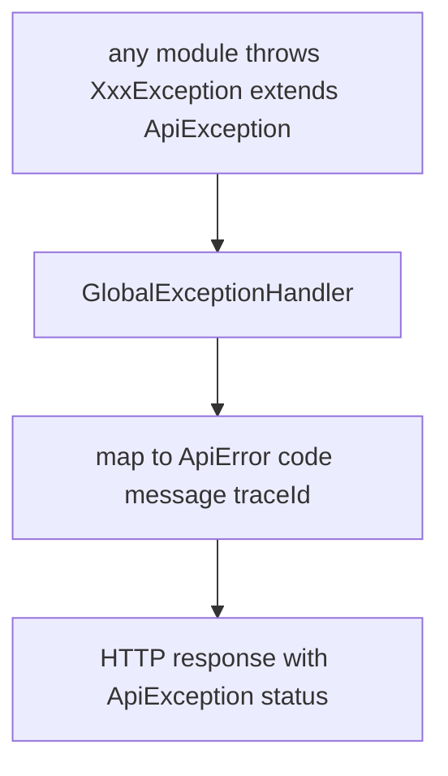

# Common Module — Design & Node Logic (`common.md`)

> Design record for the **common** module — the shared kernel. Covers **what belongs here (and what must not)**, its **contents**, and the **error contract** every module relies on. Code is authoritative.

---

## 1. Purpose & the golden rule

`common` is the **shared kernel**: the small set of types every module may depend on. It is the only module declared `OPEN` (`ApplicationModule.Type.OPEN`), so any module can import it without an explicit `allowedDependencies` entry.

**The rule:** a type belongs in `common` *only* if it is genuinely cross-cutting and stable. Business logic, entities, and module-specific types must **never** leak here — that would turn the shared kernel into a dumping ground and re-couple the modules we worked to separate. When in doubt, keep it in the owning module and expose it through that module's `api`.

---

## 2. Contents

| Type | Why it's shared |
|---|---|
| `SourceType` (`GITHUB`, `ZIP`) | Both Conductor (records a `Repository`) and Intake (fetches one) speak it. Moved here from `conductor.domain` when Intake landed. |
| `exception.ApiException` | Abstract base for all deliberate, client-facing errors — each module subclasses it (e.g. `InvalidCredentialsException`, `ResourceNotFoundException`). |
| `exception.GlobalExceptionHandler` | `@RestControllerAdvice` that turns any `ApiException` into a consistent `ApiError` with the right HTTP status. |
| `dto.ApiError` | The uniform error body: `{ code, message, traceId }`. |

---

## 3. The error contract

Every module throws its own typed subclass (with a stable `code` and an HTTP `status`); the handler in `common` renders them all identically. This is why callers — and the frontend — get one predictable error shape across the whole API. The `traceId` ties a client-visible error back to server logs (pair it with the `analysisId` that flow logs carry).

---

## 4. What's next / Phase 2

- A shared `PageResponse<T>` once list endpoints paginate.
- An MDC-based correlation id filter (request id) added to `ApiError.traceId` and the log pattern, so Splunk can group every line of one request even before an `analysisId` exists.
