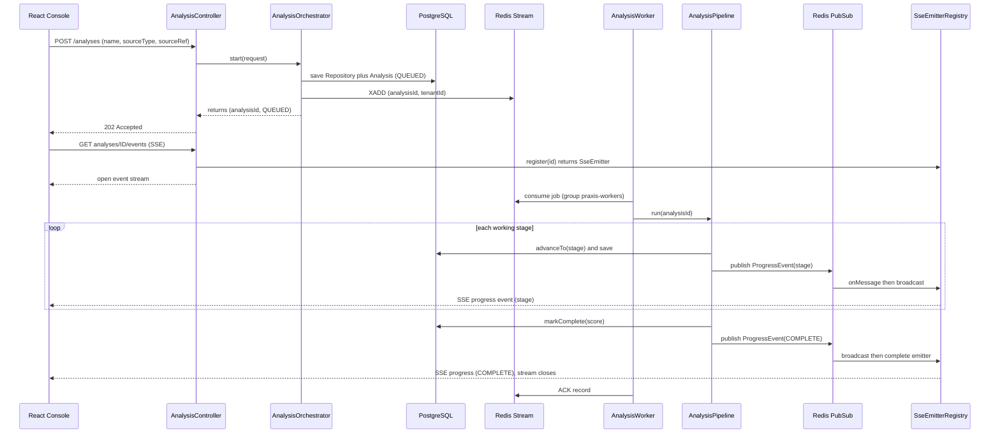

# Conductor Module — Design & Node Logic (`nodes.md`)

> This is the design record for the **Conductor** module. It covers the module's **purpose**, the end-to-end **flow**, the **architecture** of its moving parts, and the **logic at each pipeline node/stage**. The code implements this exactly; when they disagree, the code wins and this doc should be updated.

---

## 1. Purpose

Conductor is the **orchestration engine**. It exists to solve one problem: an analysis is a *long-running job* (clone + parse + many LLM calls = minutes), but HTTP requests must return in milliseconds. Conductor bridges that gap.

It owns three responsibilities and nothing else:

1. **The Analysis lifecycle** — the state machine (`QUEUED → FETCHING → PARSING → ANALYZING → SUMMARIZING → SCORING → COMPLETE | FAILED`) and the `Analysis` aggregate that enforces it.
2. **Async execution** — turn a synchronous `POST /analyses` into a background job: persist + enqueue on the request thread, run the work on a worker thread.
3. **Live progress** — stream each stage change back to the browser as it happens.

Conductor does **not** know *how* to fetch, parse, or call an LLM. Those belong to Intake, Prism, and Cortex. Right now every stage is **simulated** (a short sleep + a progress ping) so the orchestration can be proven correct in isolation, before any real module exists. Each simulated stage is a labelled seam where a real module plugs in later with **zero change** to the orchestration.

---

## 2. Where it sits

```
identity.api  ◄────────────  conductor   ────────────►  (later) intake / prism / cortex / verdict
   (Named Interface)             │
                                 ▼
                       PostgreSQL + Redis
```

Its only compile-time dependency on another module is `identity :: api` (declared in `package-info.java`), used to scope every analysis to the calling tenant. The Modulith boundary test enforces that it touches nothing else.

---

## 3. Architecture — the moving parts

| Component | Package | Role |
|---|---|---|
| `Analysis` | `domain` | Aggregate root; guards all state transitions |
| `AnalysisStatus` | `domain` | The lifecycle enum + `workingStages()` + `isTerminal()` |
| `Repository` | `domain` | The code source (temporary home — moves to Intake later) |
| `AnalysisOrchestrator` | `internal` | **Request-thread** entry: persist + enqueue, return fast |
| `JobPublisher` | `internal` | Producer → Redis **Stream** (`praxis:analysis:jobs`) |
| `AnalysisWorker` | `internal` | Consumer ← Redis Stream; runs the pipeline off the request thread |
| `AnalysisPipeline` | `internal` | Walks the stages; the **simulated** work lives here |
| `ProgressPublisher` | `internal` | Producer → Redis **Pub/Sub** (`praxis:analysis:progress`) |
| `ProgressSubscriber` | `internal` | Consumer ← Redis Pub/Sub → hands events to the SSE registry |
| `SseEmitterRegistry` | `internal` | Holds this instance's live browser SSE connections |
| `ConductorConfig` | `config` | Wires the stream consumer group + the pub/sub listener |
| `AnalysisController` | `web` | `POST /analyses`, `GET /analyses/{id}`, `GET .../events` |

### Two Redis mechanisms, on purpose

- **Stream + consumer group** for *jobs*: durable (survive restarts), load-balanced (add workers for throughput, each job handled once), reclaimable (a crashed worker's job can be retried). This is the work queue.
- **Pub/Sub** for *progress*: ephemeral fan-out. The worker running a job and the web instance holding the browser's SSE connection may be **different JVMs** once you scale out. Pub/Sub broadcasts each progress event to every instance; each instance's `SseEmitterRegistry` delivers to the browsers *it* holds. Progress is disposable telemetry, so the "lose it on restart" nature of Pub/Sub is exactly right — and it's why progress failures never fail the pipeline.

> **Java analogy:** the Stream is like a durable JMS queue with acknowledgements; Pub/Sub is like a fire-and-forget application event bus. Different guarantees for different needs.

---

## 4. End-to-end flow



The key line is `202 Accepted`: the request thread is done in milliseconds. Everything after it happens on worker/listener threads.

---

## 5. The state machine

```
              ┌─────────┐
              │ QUEUED  │  persisted, on the stream, not yet picked up
              └────┬────┘
                   ▼
   ┌──────────────────────────────────┐   working stages, strictly forward
   │ FETCHING → PARSING → ANALYZING    │   (advanceTo ignores calls once terminal)
   │        → SUMMARIZING → SCORING    │
   └───────────────┬──────────────────┘
                   ▼
         ┌───────────────────┐
         │ COMPLETE / FAILED │  terminal; no further transition possible
         └───────────────────┘
```

Enforced entirely inside `Analysis`:
- `advanceTo(next)` — no-op if already terminal (redelivery-safe), stamps `startedAt` on first move.
- `markComplete(score)` / `markFailed(reason)` — no-op if already terminal, stamp `completedAt`.

Because transitions are guarded in the aggregate (not scattered across services), a redelivered Redis job or a double-invoked worker can never corrupt an analysis's state.

---

## 6. Node logic — what each stage does

The pipeline iterates `AnalysisStatus.workingStages()`. For each stage it: (1) `advanceTo(stage)` + save, (2) publish a progress event, (3) do the stage's work. Below, **Now** = current simulated behavior; **Becomes** = the real module that plugs into that seam.

| Node | Now (simulated) | Becomes (real) | Plug-in seam |
|---|---|---|---|
| **FETCHING** | sleep + "Fetching source code…" | Clone the GitHub URL / extract the zip into a sandboxed temp dir; filter to `.java`; enforce size/count/timeout guards | `intake.api.SourceFetcher` |
| **PARSING** | sleep + "Parsing and measuring code…" | JavaParser + SymbolSolver → metrics (complexity, coupling), pattern/anti-pattern detection, per-unit **risk score**; persist `file_result` / `code_unit` / STATIC `issue_finding` | `prism.api.StaticAnalyzer` |
| **ANALYZING** | sleep + "Selecting high-risk code…" | The **funnel**: select only `code_unit`s where `risk_score ≥ threshold` — this is the cost lever that stops us sending the whole repo to the LLM | Conductor's own selection logic (reads Prism output) |
| **SUMMARIZING** | sleep + "Generating explanations…" | For the selected units only: LLM explanations, refactors, JavaDoc via Spring AI; write AI `issue_finding` + `llm_call` rows; honor `LOCAL_ONLY` tenants (Ollama) | `cortex.api.LlmEnricher` |
| **SCORING** | random 55–95 placeholder | Aggregate static + AI signals into a 0–100 Repository Health Score with a transparent, versioned formula | `verdict.api.HealthScorer` |

Replacing a node means swapping its `sleep()` for a real call inside `AnalysisPipeline`. The state machine, the worker, the SSE relay, the controller, and the DB writes **do not change** — that is the entire reason for building the skeleton simulated first.

---

## 7. Key design decisions (and why)

1. **Persist-then-enqueue, never enqueue-then-work.** The orchestrator saves rows and puts a *tiny* job (`{analysisId, tenantId}`) on the stream. The worker re-loads the full `Analysis` from the DB. The queue never carries mutable state — the database is the single source of truth.
2. **Idempotency in the aggregate.** Redis Streams give *at-least-once* delivery, so a job can be redelivered (e.g. after a crash before ACK). `AnalysisPipeline` bails out if the analysis is already terminal, and `advanceTo` refuses backward moves. Re-processing is therefore safe.
3. **Progress is best-effort.** A failure to publish progress logs a warning and continues — telemetry must never break the actual work.
4. **SSE that survives horizontal scaling.** Progress travels worker → Pub/Sub → *every* instance → local emitters. This works whether you run one JVM or ten, with no sticky sessions required.
5. **Virtual threads for the worker.** Jobs are I/O-bound (git, parsing, and later LLM waits), so `Executors.newVirtualThreadPerTaskExecutor()` (Java 21) gives high concurrency cheaply.
6. **Tenant scoping is non-negotiable.** Every read goes through `findByIdAndTenantId`; the SSE endpoint verifies ownership *before* streaming. A user can never observe another tenant's analysis.
7. **`Repository` lives here temporarily.** Conductor owns it now only because it's the first module to need a code source. When Intake grows real repository management, the entity moves and Conductor references it by id (it already does — via a raw `repositoryId` UUID, no JPA association).

---

## 8. Running & verifying the slice

Prereqs: Postgres (pgvector image) + Redis running, backend up, and a JWT from the Identity module.

```bash
TOKEN=$(curl -s -X POST http://localhost:8080/api/v1/auth/register \
  -H 'Content-Type: application/json' \
  -d '{"email":"dev@praxis.io","password":"password123","tenantName":"Acme"}' | jq -r .token)

# 1. Start an analysis -> expect HTTP 202 + {analysisId, "QUEUED"}
ANALYSIS=$(curl -s -X POST http://localhost:8080/api/v1/analyses \
  -H "Authorization: Bearer $TOKEN" -H 'Content-Type: application/json' \
  -d '{"name":"demo","sourceType":"GITHUB","sourceRef":"https://github.com/x/y"}')
ID=$(echo "$ANALYSIS" | jq -r .analysisId)

# 2. Watch live progress -> five stages then COMPLETE, stream closes
curl -N -H "Authorization: Bearer $TOKEN" http://localhost:8080/api/v1/analyses/$ID/events

# 3. Poll final state -> {"status":"COMPLETE","healthScore":..}
curl -s -H "Authorization: Bearer $TOKEN" http://localhost:8080/api/v1/analyses/$ID | jq
```

**✅ Checkpoint:** the SSE stream emits `FETCHING → PARSING → ANALYZING → SUMMARIZING → SCORING → COMPLETE`, then `GET /analyses/{id}` shows `COMPLETE` with a health score. The async machinery is proven — every remaining module is now just replacing a `sleep()`.

---

## 9. What plugs in next

Per the build guide, the next module is **Intake** (real `FETCHING`), then **Prism** (real `PARSING` + risk scores), at which point the **ANALYZING** funnel becomes real selection logic instead of a sleep. Nothing in this module needs to change for that to happen.

### Known hardening deferred to Phase 2
- **Pending-message reclaim**: a crashed worker leaves an unacked stream entry. Add a scheduled `XAUTOCLAIM` to reassign stale pending jobs. Safe to defer because the idempotency guard already makes reprocessing correct.
- **AFTER_COMMIT publish**: publishing the job strictly after the DB transaction commits (via a transaction synchronization / application event) closes a tiny race where a very fast worker could read before commit. The worker's DB re-read makes this benign for the MVP.
