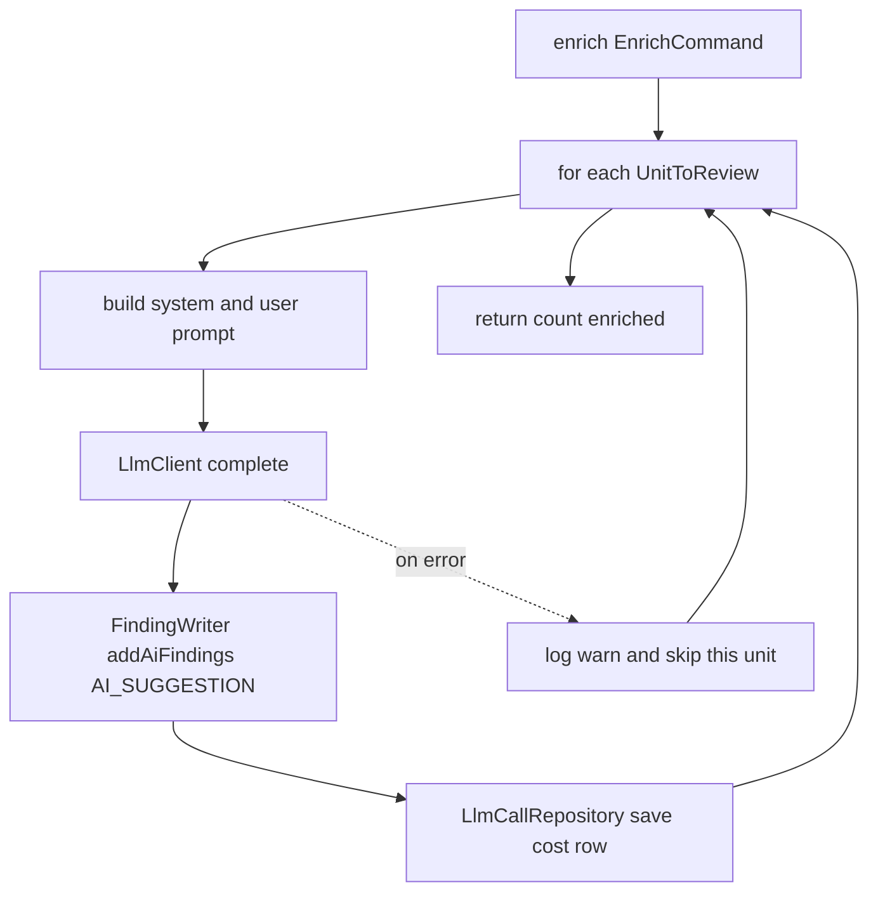

# Cortex Module — Design & Node Logic (`cortex.md`)

> Design record for the **Cortex** module — the AI layer and the `SUMMARIZING` stage. Covers **purpose**, the **provider seam** (why it ships stubbed), **flow**, **cost accounting**, and **testing**. Code is authoritative.

---

## 1. Purpose

Cortex answers: *for the risky units the funnel selected, explain the risk and suggest a fix.* It builds a prompt per unit, calls a model, stores the result as an **AI finding** (via Prism's `FindingWriter`), and records a **cost row** per call.

It only ever sees the high-risk minority — that's the whole point of the funnel upstream. `allowedDependencies = {prism :: api, common}`.

---

## 2. The provider seam

The one thing Cortex needs from a model is `LlmClient.complete(system, user) -> LlmResponse`. Keeping that interface tiny lets us swap providers with **zero change to `CortexService`** — it doesn't know which client it holds. Exactly one client is active at startup, chosen by `praxis.cortex.provider` and gated with `@ConditionalOnProperty`:

| `praxis.cortex.provider` | Client | Notes |
|---|---|---|
| `stub` *(default)* | `StubLlmClient` | Deterministic, offline, no keys, cost 0 — for tests/CI/demos |
| `ollama` | `OllamaLlmClient` | **Local** models via `/api/chat`; no key, no per-token cost |
| `openai` | `OpenAiLlmClient` | `/v1/chat/completions`; needs `OPENAI_API_KEY` |
| `gemini` | `GeminiLlmClient` | `generateContent`; needs `GEMINI_API_KEY` (sent as `x-goog-api-key`) |

All real clients share `AbstractHttpLlmClient`, which uses Spring's **`RestClient` + Jackson `JsonNode`** (no Spring AI dependency — compiles across Spring AI versions) with per-provider timeouts and uniform error mapping. Adding a new provider = one class + one `@ConditionalOnProperty` value; nothing else moves. That's the "leave it ready to scale" seam.

### Config (all under `praxis.cortex.*`, env-overridable)
```
provider: stub            # stub | ollama | openai | gemini   (CORTEX_PROVIDER)
temperature: 0.2          # shared by all real providers
ollama.model: qwen2.5-coder:7b     # OLLAMA_MODEL — strong open code model; :32b if hardware allows
openai.model: gpt-4o               # OPENAI_MODEL — gpt-4o-mini for lower cost
gemini.model: gemini-1.5-pro       # GEMINI_MODEL — 1.5-flash for speed; newer models drop in
```
Model names are just config strings, so upgrading to a newer/best model is a config change, not a code change.

### Degrade, don't fail
`complete(...)` throws `LlmUnavailableException` when a provider is unreachable or a key is missing. `CortexService` catches it and **stops the batch**, letting the analysis complete on static findings alone — instead of eating one timeout per remaining unit. A per-unit error (bad response, one 4xx) only skips that unit.

---

## 3. Public API (`cortex :: api`)

| Type | Meaning |
|---|---|
| `LlmEnricher` | `enrich(EnrichCommand) -> int` (units successfully enriched) — the SUMMARIZING entry point |
| `EnrichCommand` | `analysisId`, `tenantId`, `List<UnitToReview>` |
| `UnitToReview` | `codeUnitId`, `unitType`, `name`, `sourceSnippet` |

---

## 4. Flow



Each unit is handled independently in a try/catch, so **one failing model call cannot abort the batch** — the rest still get reviewed.

---

## 5. Cost accounting

Every call writes an `llm_call` row: `provider`, `model`, `task_type`, `tokens_in/out`, `cost_cents`, `cache_hit`. The stub estimates tokens as `chars/4` and records `cost_cents = 0`. This table is Cortex's for now; when the **Ledger** module grows real budgets/quotas it takes ownership, and Cortex emits an event instead of writing directly.

---

## 6. Testing

| Test | Proves |
|---|---|
| `CortexServiceTest` | One AI finding + one cost row **per unit**; a single failing unit does **not** abort the batch (returns the successful count) |

Uses a mocked `LlmClient` for determinism and mocked `FindingWriter` / `LlmCallRepository` — no DB, no model.

---

## 7. What's next / Phase 2

- **Structured output**: ask the model for JSON (`summary` + `suggestion` + inferred severity) and parse it, instead of storing free text as the suggestion. Kept as free text for now for cross-provider robustness.
- **Recall** cache: skip the model entirely for units whose `source_hash` matches a prior embedding — the biggest cost saver (see `recall.md`).
- **Ledger** pricing: map `(provider, model, tokens)` → `cost_cents` (recorded as 0 today; token counts are already real for Ollama/OpenAI/Gemini). See `ledger.md`.
- More providers (Anthropic, Azure OpenAI, Bedrock) — each is a new `AbstractHttpLlmClient` subclass + a `provider` value.
- Retry/backoff and a per-provider circuit breaker (Resilience4j is already on the classpath).
