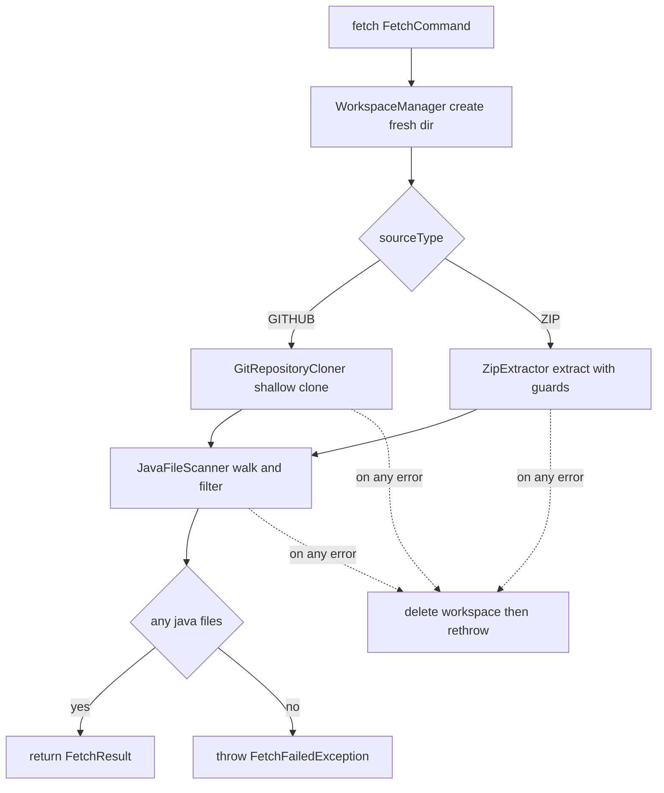

# Intake Module — Design & Node Logic (`intake.md`)

> Design record for the **Intake** module and how it plugs into the Conductor pipeline's `FETCHING` stage. Covers **purpose**, **flow**, **architecture**, the **safety guards**, the **before/after pipeline change**, and **testing**. Code is authoritative; update this when they diverge.

---

## 1. Purpose

Intake answers one question: *given a code source, give me the `.java` files to analyze, safely.* It turns a GitHub URL or an uploaded zip into a filtered set of `.java` files inside a **sandboxed, ephemeral workspace**, and hands that to whoever asked (Conductor).

It is a **leaf service**: it depends on nothing but the OPEN `common` module (`allowedDependencies = {}`). Conductor calls Intake — never the reverse. That keeps the risky "download and touch untrusted files" logic isolated behind one interface.

---

## 2. Where it sits

```
conductor  ──(intake :: api)──►  intake  ──► ephemeral workspace on disk
                                    │
                                    └─ depends only on common (SourceType)
```

Conductor's `AnalysisPipeline` calls `SourceFetcher.fetch(...)` during `FETCHING`, uses the returned files in later stages, then calls `SourceFetcher.release(...)` to delete the workspace.

---

## 3. Public API (the only thing other modules see)

| Type | Meaning |
|---|---|
| `SourceFetcher` | `fetch(FetchCommand) -> FetchResult` and `release(FetchResult)` |
| `FetchCommand` | `analysisId`, `SourceType` (from `common`), `sourceRef` |
| `FetchResult` | `workspacePath`, `List<JavaFile>` (+ `fileCount()`, `totalSizeBytes()`) |
| `JavaFile` | `relativePath`, `absolutePath`, `sizeBytes` — content read lazily by Prism |

`sourceRef` meaning: **GITHUB** = a clonable `https://` URL; **ZIP** = an absolute path to a `.zip` already on disk (upload wiring is deferred).

---

## 4. Architecture — the moving parts

| Component | Role |
|---|---|
| `SourceFetcherImpl` | Public service; orchestrates create → materialize → scan → return; deletes workspace on failure |
| `WorkspaceManager` | Creates a fresh per-analysis dir (wiping any stale one); deletes recursively on release |
| `GitRepositoryCloner` | JGit shallow clone (`depth 1`), http(s)-only, watchdog-enforced timeout |
| `ZipExtractor` | Extracts a zip with zip-slip and zip-bomb defenses |
| `JavaFileScanner` | Walks the workspace, keeps only `.java`, skips build/vcs dirs, enforces count/size guards |
| `IntakeProperties` | The safety envelope (bound from `praxis.intake.*`) |

---

## 5. Flow



Later, `release(FetchResult)` deletes the workspace. In Conductor this happens in the pipeline's `finally` — success or failure.

---

## 6. Safety guards (why each exists)

Fetching runs *untrusted* code sources, so every limit is deliberate. All are configurable under `praxis.intake.*`.

| Guard | Default | Stops |
|---|---|---|
| `max-files` | 5000 | A repo with an absurd file count exhausting memory/time |
| `max-total-size-mb` | 200 | A giant source filling the disk |
| `max-file-size-mb` | 2 | A single huge "file" that isn't real source (skipped, not fatal) |
| `clone-timeout-seconds` | 120 | A clone that hangs forever (watchdog interrupts the thread) |
| `max-compression-ratio` | 120 | **Zip bombs** — a tiny entry that explodes to gigabytes |
| zip-slip check | always | **Path traversal** — an entry like `../../etc/passwd` escaping the workspace |
| http(s)-only URL check | always | `file://` / `ssh://` tricks pointed at the server |

We **parse, never execute** downloaded code, which already removes the largest class of risk; these guards cover the rest. `.gitignore` handling is pragmatic: a git *clone* only contains committed files, and for zips we skip the well-known `target/ build/ out/ bin/ node_modules/ .git/ .idea/ .gradle/` dirs. Full `.gitignore` parsing is Phase 2.

---

## 7. Before / after — the pipeline change (flow kept intact)

Wiring in a *real* stage forced one structural change to Conductor, done carefully so nothing else moved.

**Before:** every stage was an independent `sleep()`. Stages shared no state.

**After:** a `PipelineContext` is threaded through the run to carry a stage's output to the next stage's input. Only **ephemeral** handles live in it (the temp workspace + file list); **durable** results still go to Postgres.

What changed, precisely:
- `AnalysisPipeline` now injects `SourceFetcher` + `CodeRepositoryRepository`.
- `FETCHING` is real: it loads the `Repository` row, calls `SourceFetcher.fetch(...)`, stores the `FetchResult` in the context, and reports the file count in its progress event.
- `PARSING / ANALYZING / SUMMARIZING / SCORING` are **unchanged** — still simulated.
- A `finally` block **always** calls `SourceFetcher.release(...)` so the workspace is deleted on success *and* failure.
- The state machine, worker, SSE relay, controller, and DB writes are **untouched** — exactly the payoff of having built the skeleton simulated first.

`SourceType` moved from `conductor.domain` to the `common` shared kernel, since both Conductor (records a `Repository`) and Intake (fetches one) now speak it.

---

## 8. Testing

All tests are pure — no network, no DB, no Spring context — so they run in milliseconds.

| Test | Proves |
|---|---|
| `JavaFileScannerTest` | Keeps only `.java`; ignores `target/`, `.git/`; skips oversized files; rejects too-many-files |
| `WorkspaceManagerTest` | `create()` makes a fresh dir and wipes a stale one; `delete()` removes recursively |
| `ZipFetchTest` | Full ZIP path returns the right files; **blocks zip-slip**; fails clearly when no `.java` present; `release()` deletes the workspace |
| `AnalysisPipelineTest` | Whole pipeline reaches `COMPLETE`; `FETCHING` calls Intake with the repo's source; workspace **always released**; a redelivered terminal job is a no-op |

`AnalysisPipelineTest` is the one that guarantees the **flow stayed intact** — it mocks Intake and asserts the orchestration still walks every stage and cleans up.

### Manual end-to-end (real clone)
```bash
# GitHub source — a small public Java repo
curl -X POST http://localhost:8080/api/v1/analyses \
  -H "Authorization: Bearer $TOKEN" -H 'Content-Type: application/json' \
  -d '{"name":"demo","sourceType":"GITHUB","sourceRef":"https://github.com/junit-team/junit4"}'
# SSE now shows: FETCHING ("Fetched N Java files") -> PARSING -> ... -> COMPLETE
```

---

## 9. What's next

**Prism** replaces the simulated `PARSING`: JavaParser + SymbolSolver over `FetchResult.files()`, producing metrics, pattern detection, and the per-unit **risk score**. Once Prism writes real `code_unit` rows, the `ANALYZING` stage becomes the real **funnel** (select `risk_score >= threshold`) instead of a sleep. `PipelineContext` will carry Prism's parsed model forward, exactly as it now carries the fetched files.

### Deferred to Phase 2
- Private-repo auth (GitHub OAuth tokens) in `GitRepositoryCloner`.
- Real zip **upload** endpoint (currently `sourceRef` must be a path already on disk).
- Full `.gitignore` parsing.
- Moving the `Repository` entity from Conductor to Intake once repository management grows real (re-fetch, history) — Conductor already references it only by id, so the move won't ripple.
