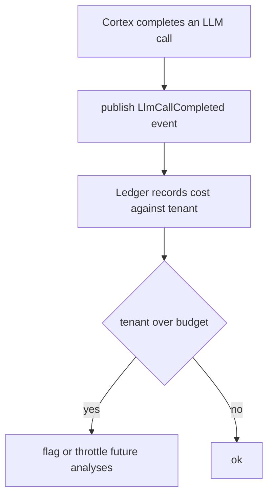

# Ledger Module — Design & Node Logic (`ledger.md`)  *(Phase 2 — not yet implemented)*

> Forward design record for **Ledger**, cost & quota accounting. **No code exists yet** — this documents the intended shape and the **seam already in place** (Cortex currently owns the `llm_call` table on its behalf).

---

## 1. Purpose

Ledger answers: *how much is each tenant spending on AI, and have they hit their limit?* It turns the raw `llm_call` rows into **per-tenant cost, usage, and budget enforcement** — the commercial backbone of a SaaS that resells expensive model calls.

---

## 2. Current state — the seam

Cortex **temporarily owns** the `llm_call` entity and writes one row per model call (`provider`, `model`, `task_type`, `tokens_in/out`, `cost_cents`, `cache_hit`). This is explicitly a placeholder:

> When Ledger lands, ownership of `llm_call` moves to it, and Cortex stops writing directly — instead it **emits a domain event** (`LlmCallCompleted`) that Ledger consumes. Spring Modulith's application events make this a clean, in-process swap with no shared tables.

Intended dependency: `allowedDependencies = {identity :: api, common}` (needs the tenant; not the analysis internals).

---

## 3. Planned responsibilities

- **Pricing**: map `(provider, model, tokens)` → `cost_cents` (Cortex currently records 0 for the stub; Ledger owns the real price book).
- **Budgets**: per-tenant monthly caps; a pre-flight check Conductor can call before starting an expensive analysis.
- **Reporting**: usage/cost endpoints for an admin dashboard (Chronicle-style read APIs).

---

## 4. What must be true before building it

- The event boundary: Cortex refactored to publish `LlmCallCompleted` rather than persist directly (one small, well-contained change — the write is already isolated in `CortexService`).
- A pricing source of truth (config or a `price_book` table).
- A policy decision on **over-budget behavior**: hard-block vs. degrade to static-only analysis (skip Cortex). The pipeline's funnel already makes "static-only" a natural fallback.
