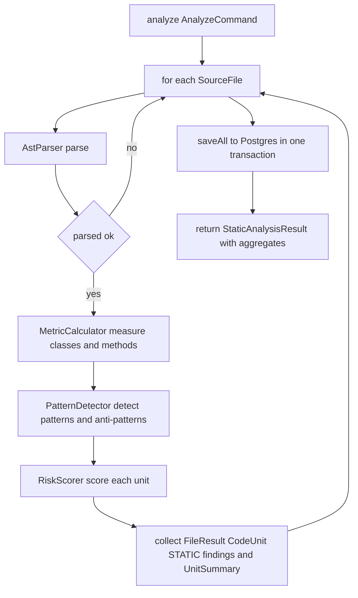

# Prism Module — Design & Node Logic (`prism.md`)

> Design record for the **Prism** module — the deterministic static-analysis engine and the `PARSING` stage of the pipeline. Covers **purpose**, **flow**, **metrics/patterns**, the **risk score** (the funnel's fuel), **persistence ownership**, and **testing**. Code is authoritative; update this when they diverge.

---

## 1. Purpose

Prism answers: *given `.java` files, what does the code look like, and which parts are risky?* It parses each file into an AST, measures it, detects design/anti-patterns, and computes a per-unit **risk score** (0–100). No AI, no network — **pure and deterministic**, which makes it the most heavily unit-tested module.

Prism is the product's cost lever: it grades every unit cheaply so that only the risky minority is sent to the expensive LLM (see the funnel in Conductor).

It is a **leaf**: `allowedDependencies = {common}`.

---

## 2. Where it sits

```
conductor ──(prism :: api)──► prism ──► Postgres (file_result, code_unit, issue_finding)
cortex    ──(prism :: api)──► prism (FindingWriter to record AI findings)
chronicle ──(prism :: api)──► prism (AnalysisResultQuery for the dashboard)
```

Conductor calls `StaticAnalyzer.analyze(...)` during `PARSING`. Prism owns the three analysis-result tables; other modules read/append through its API, never its internals.

---

## 3. Public API (`prism :: api`)

| Type | Meaning |
|---|---|
| `StaticAnalyzer` | `analyze(AnalyzeCommand) -> StaticAnalysisResult` — the PARSING entry point |
| `AnalysisResultQuery` | `files(id)`, `fileDetail(id, fileId)`, `severityCounts(id)` — read side |
| `FindingWriter` | `addAiFindings(analysisId, codeUnitId, findings)` — Cortex writes AI results here |
| `AnalyzeCommand` | `analysisId`, `List<SourceFile>` (adapted from Intake's `JavaFile`) |
| `StaticAnalysisResult` | `List<UnitSummary>`, `totalFiles`, `totalLoc`, `averageComplexity` |
| `UnitSummary` | one unit + `riskScore` + `sourceSnippet` (carried in-memory for the funnel) |
| `SeverityCounts` | critical/major/minor/info tallies (fed to Verdict) |
| `FileSummary` / `FileDetail` / `FindingView` | dashboard read shapes |
| `AiFinding` | shape Cortex hands back to `FindingWriter` |

---

## 4. Architecture — the moving parts

| Component | Role |
|---|---|
| `AstParser` | Reads a file, parses it (BLEEDING_EDGE grammar), **failure-tolerant** — one bad file is skipped, not fatal |
| `MetricCalculator` | Pure metrics: **cyclomatic complexity** (McCabe decision-point count) and **lines of code** (node span) |
| `PatternDetector` | Class-level: Singleton, Builder, God Object. Method-level: High Complexity, Long Method |
| `RiskScorer` | Combines metrics + findings into 0–100; the funnel filters on this |
| `StaticAnalyzerImpl` | Orchestrates parse → measure → detect → score → persist, one transaction per analysis |
| `AnalysisResultQueryImpl` | Read model; attributes findings to files via an explicit `finding → code_unit → file` join |
| `FindingWriterImpl` | Persists AI findings from Cortex into the shared `issue_finding` table |
| `PrismProperties` | Thresholds bound from `praxis.prism.*` |

---

## 5. Flow



The returned `UnitSummary` list carries each unit's `sourceSnippet` in memory so the Conductor funnel can hand high-risk units straight to Cortex without re-reading the workspace (which Intake deletes right after).

---

## 6. Metrics, patterns, and the risk score

**Cyclomatic complexity** = `1 + decision points`, counting `if / for / forEach / while / do / catch / case-label / ternary` and each short-circuit `&&` / `||`. Standard McCabe.

**Patterns detected** (conservative — only shapes reliable *without* cross-file type resolution):
- `SINGLETON` (INFO): all-private constructors + a static self-typed field.
- `BUILDER` (INFO): a nested `Builder` class with a `build()` method.
- `GOD_OBJECT` (MAJOR): methods `> praxis.prism.god-object-methods` **or** lines `> god-object-loc`.
- `HIGH_COMPLEXITY` (MAJOR): complexity `>= praxis.prism.high-complexity`.
- `LONG_METHOD` (MINOR): lines `> praxis.prism.long-method-loc`.

Factory / Observer detection is **deferred** (too noisy heuristically) — it slots behind the same `PatternDetector` interface later.

**Risk score (0–100)** is intentionally simple and monotonic so it's explainable:
- *Method*: `min(60, complexity*6) + min(25, loc/4) + findingBump`.
- *Class*: `min(40, methods*2) + min(30, loc/20) + findingBump`.
- `findingBump`: CRITICAL +40, MAJOR +25, MINOR +10, INFO +0. Clamped to 0–100.

---

## 7. Persistence ownership (a deliberate call)

Both Prism (STATIC findings) and Cortex (AI findings) write `issue_finding`. To avoid two modules owning one table, **Prism owns** `file_result` / `code_unit` / `issue_finding`, and exposes `FindingWriter` so Cortex appends AI findings through Prism's API. The dashboard then reads *all* findings from one place. When a dedicated findings/Ledger module grows up, this seam can move — callers won't change.

`V2__analysis_results.sql` added `file_result.source` because the workspace is deleted after each run; the dashboard needs the source text to render code, so Prism persists it.

---

## 8. Testing

| Test | Proves |
|---|---|
| `MetricCalculatorTest` | Complexity counts each branch + `&&`/`||`; straight-line code = 1; LOC = node span |
| `PatternDetectorTest` | Detects Singleton/Builder; flags God Object, Long Method, High Complexity; clean class = no findings |
| `RiskScorerTest` | Complexity+length combine; findings raise risk; score clamps at 100; class scoring |

All pure — no DB, no Spring — millisecond tests.

---

## 9. What's next / Phase 2

- **SymbolSolver**: full cross-file type resolution for accurate coupling and a real call graph (needs source roots + ideally classpath; degrades gracefully today).
- **Recall**: embed each analyzed unit (`source_hash`) into pgvector so unchanged units skip re-analysis and the LLM entirely (semantic cache). The `analysis_embedding` table already exists.
- More patterns (Factory, Observer, Strategy) and configurable rule packs.
