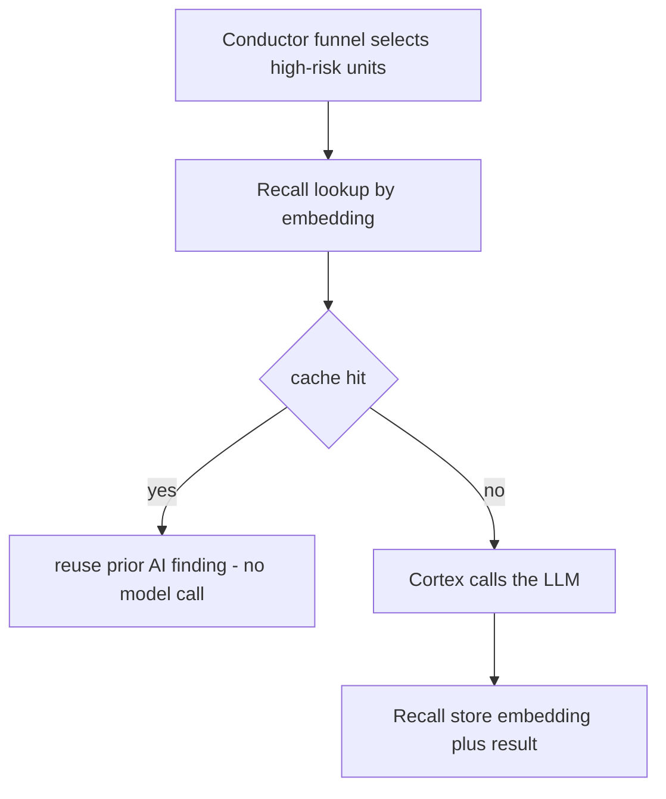

# Recall Module — Design & Node Logic (`recall.md`)  *(Phase 2 — not yet implemented)*

> Forward design record for **Recall**, the semantic cache. **No code exists yet** — this documents the intended shape and, importantly, the **seams already in place** so a new developer can build it without disturbing the rest of the system.

---

## 1. Purpose

Recall answers: *have we already reviewed code that looks like this — so we can skip the LLM?* It is the single biggest **cost saver**. Before Cortex spends a model call on a unit, Recall checks whether a semantically-equivalent unit was analyzed before (same code, or close enough), and if so **returns the prior AI finding** instead of paying for a new one.

Static analysis (Prism) already skips *nothing* — it's cheap. The expensive step is the LLM. Recall makes the funnel even narrower: `high-risk AND not-already-known`.

---

## 2. Where it will sit

Intended dependency: `allowedDependencies = {prism :: api, common}` (it reads unit source/hashes). Conductor will consult Recall between `ANALYZING` (funnel) and `SUMMARIZING` (Cortex).

---

## 3. Seams already in place (so the build is low-risk)

- **`analysis_embedding` table** already exists in `V1__init.sql`: `code_unit_id` + `vector(768)` (pgvector). Recall's store target is ready.
- **`code_unit.source_hash`** is already computed by Prism (SHA-256 of the unit's text) — an **exact-match** cache tier needs nothing more than a lookup on this column.
- **Cortex's `LlmClient` seam** means Recall can be layered *in front of* the model without changing Cortex: a `CachingLlmClient` decorator, or a Conductor-level check, both fit cleanly.

---

## 4. Planned design

Two tiers, cheap-first:
1. **Exact**: match `source_hash` — identical code returns the stored finding instantly (no vector math).
2. **Semantic**: embed the unit, `ORDER BY embedding <=> :query LIMIT 1` in pgvector; if cosine distance is under a threshold, reuse the finding.

Embeddings come from the same provider family as Cortex (behind an `Embedder` seam mirroring `LlmClient`), so the stub-first pattern applies here too.

---

## 5. What must be true before building it

- A real embedding provider (or a deterministic stub `Embedder` for offline tests).
- A tenant-isolation decision: caches are **per-tenant** by default (never leak one customer's code understanding to another); a global "public OSS" tier is a later opt-in.
