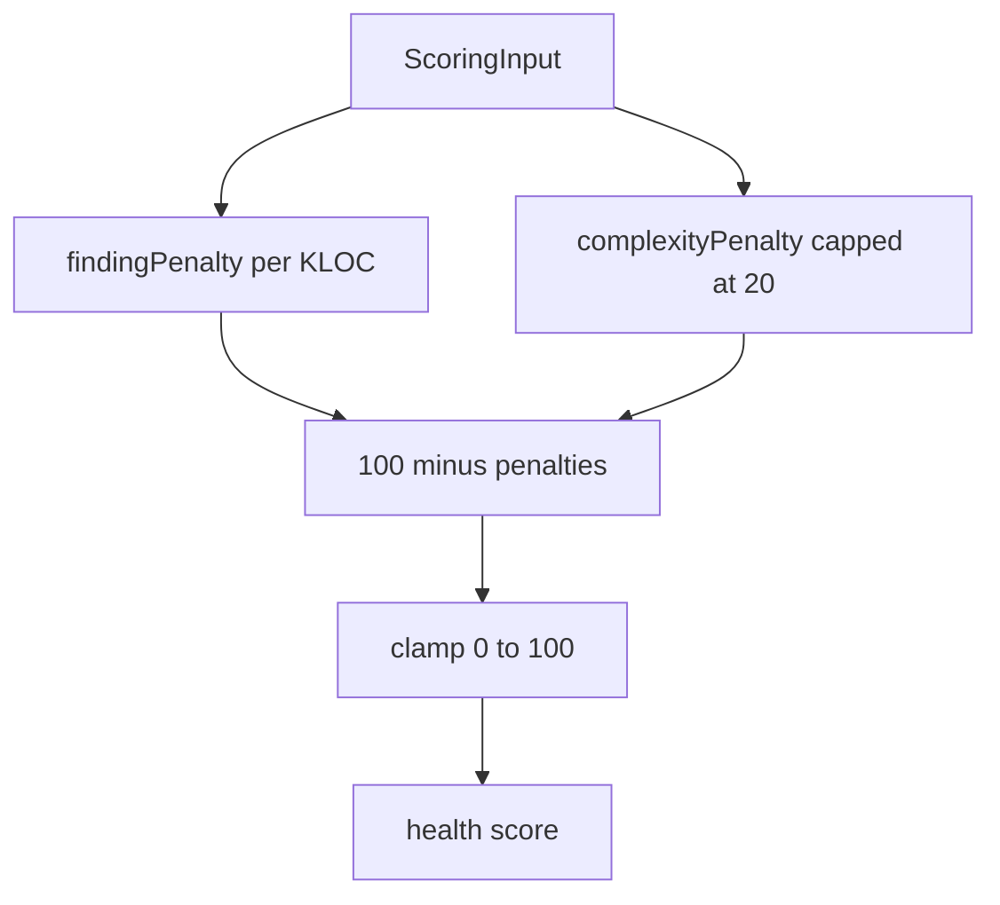

# Verdict Module — Design & Node Logic (`verdict.md`)

> Design record for the **Verdict** module — the `SCORING` stage. Covers **purpose**, the **formula**, **why it's a pure function**, and **testing**. Code is authoritative.

---

## 1. Purpose

Verdict answers one question with one number: *how healthy is this repository, 0–100?* It's a **pure function** of a flat `ScoringInput` — no persistence, no other modules (`allowedDependencies = {common}`) — which makes it fully deterministic and trivially testable.

The pipeline gathers the input (Prism aggregates + finding tallies) and calls `HealthScorer.score(...)`; Conductor stores the result via `analysis.markComplete(score)`. Verdict never touches Conductor's entity — keeping the boundary clean.

---

## 2. Public API (`verdict :: api`)

| Type | Meaning |
|---|---|
| `HealthScorer` | `score(ScoringInput) -> int` (0–100) |
| `ScoringInput` | `totalFiles`, `totalLoc`, `averageComplexity`, `critical/major/minor/info` finding counts |

---

## 3. The formula (`FORMULA_VERSION = v1`)

```
health = 100
       − findingPenalty      = (critical*8 + major*3 + minor*1) per 1000 lines
       − complexityPenalty   = min(20, max(0, (avgComplexity − 5) * 2))
clamped to [0, 100]
```

Two deliberate choices:
- **Normalized by KLOC** so a large repo isn't punished merely for having more code — the same absolute finding count hurts a 1 KLOC repo far more than a 50 KLOC one.
- **Versioned** (`FORMULA_VERSION`) so the formula can evolve without silently rewriting historical scores.



---

## 4. Testing

| Test | Proves |
|---|---|
| `HealthScorerTest` | Clean code = 100; findings reduce per-KLOC; complexity penalty caps at 20; never below 0; larger codebase is normalized (same findings hurt less) |

---

## 5. What's next / Phase 2

- Weighting knobs exposed via `praxis.verdict.*` (per-severity weights, complexity threshold).
- Sub-scores (maintainability, complexity, risk) surfaced alongside the headline number.
- Trend scoring across an analysis history (needs the history the Chronicle list already exposes).
