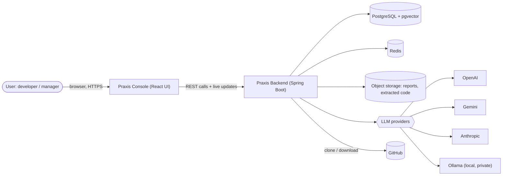
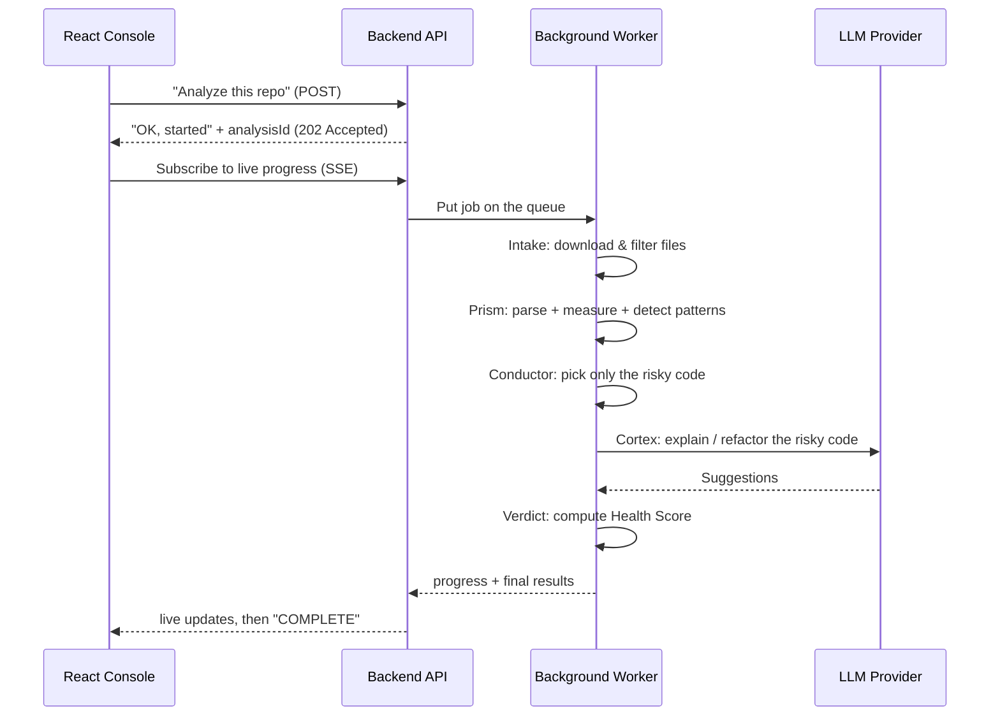
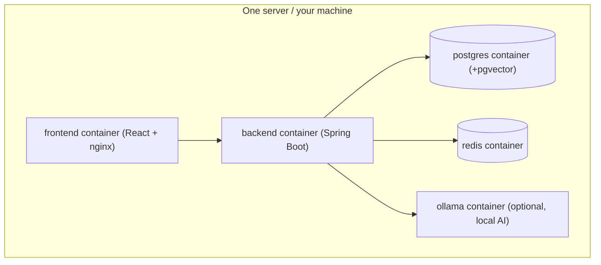

# Praxis — High Level Design (HLD)

> **Read this first.** The HLD is the *map*. It explains **what** we're building, **who** it's for, the **big moving parts**, and **how data flows** — without code. Once this makes sense, the **LLD** (`LLD-README.md`) gives the concrete blueprint you build from.

---

## 1. What is Praxis, in one paragraph

Praxis is a web platform that reads a Java codebase and helps a developer **understand, review, document, and improve** it. It does this in two layers. First, a **deterministic** layer (classic static analysis) measures the code and finds structural problems — "this method is too complex," "this class does too much." Second, an **AI (LLM)** layer takes those findings and explains them like a senior engineer would — *why* it's a problem here, *how* to fix it, *which design pattern* fits, and *how* it would scale. Traditional tools (SonarQube, PMD) tell you **what** is wrong. Praxis adds the **why and the how**.

### The one mental model to remember

```
Static analysis  = cheap, exact, boring → finds & measures problems  ("WHAT")
LLM              = expensive, smart, contextual → explains & fixes   ("WHY / HOW")
```

Static analysis runs first and acts as a **filter**. Only the risky code it flags gets sent to the expensive LLM. This keeps cost sane and quality high. This funnel is the single most important idea in the whole system.

> **Java analogy:** think of static analysis as a fast, dumb `if`-based validator, and the LLM as an expensive expert consultant. You don't call the consultant for every field — you validate cheaply first, then only escalate the hard cases.

---

## 2. Who uses it (personas)

| Persona | What they want |
|---|---|
| Junior dev / student | Learn *why* code is bad and see how a senior would rewrite it |
| Backend / full-stack dev | Self-review a branch before opening a Pull Request |
| Senior dev / reviewer | Let the tool handle mechanical review; focus on business logic |
| Architect | See coupling maps and refactor targets before a migration |
| Manager / team lead | Track a "Repository Health Score" over time |

---

## 3. What the MVP can do (capabilities)

- Accept a codebase as a **`.zip` upload** or a **public GitHub URL**.
- Support **Java 8–21** only (one language, done well).
- Run **static analysis**: complexity, size, coupling, and detect design patterns (Singleton, Factory, Builder, Observer) and anti-patterns (God Object, long method).
- Use an **LLM** to explain smells, suggest refactors, write JavaDoc, and explain confusing methods — **only on flagged code**.
- Show results in a **web dashboard**: file tree, source viewer with highlighted issues, and a side panel of suggestions.
- Give an overall **Repository Health Score** (0–100 / A–F).
- Let users **ask follow-up questions** in a chat about specific code.
- Offer a **"local only" mode** (using a local model via Ollama) so private code never leaves your servers.

---

## 4. System context — who talks to what



Plain English: the **browser** talks only to the **backend**. The backend talks to a database, a cache, file storage, GitHub, and one of several AI providers.

---

## 5. The building blocks (modules)

Praxis is **one application** internally split into clear modules (a "modular monolith" — see glossary). Each module owns one job.

| # | Module | Codename | Its one job |
|---|---|---|---|
| 1 | Identity & Tenancy | **Identity** | Log users in, know which company (tenant) they belong to, control access |
| 2 | Ingestion | **Intake** | Download/unzip the code into a safe temporary folder and list the `.java` files |
| 3 | Static Analysis | **Prism** | Parse the code into a tree, measure it, detect patterns — no AI |
| 4 | Orchestration | **Conductor** | Run the whole job step by step; decide which code to send to the AI |
| 5 | AI Intelligence | **Cortex** | Talk to the LLM: explain, refactor, document |
| 6 | Knowledge / Search | **Recall** | Store code as searchable vectors so chat can find relevant code |
| 7 | Scoring | **Verdict** | Combine all findings into the Health Score |
| 8 | Reporting | **Chronicle** | Serve dashboard data; export PDF/Markdown reports |
| 9 | Usage & Cost | **Ledger** | Count tokens/cost per tenant; enforce budgets |

> **React analogy:** each module is like a well-scoped React feature folder — it has a clear public interface and hides its internals. Modules never reach into each other's private classes.

---

## 6. How one analysis flows, end to end

This is a **long-running job** (cloning + parsing + many AI calls can take minutes), so it does **not** happen in a single web request. The browser starts the job and then listens for progress.



### The job's life stages (state machine)

```
QUEUED → FETCHING → PARSING → ANALYZING → SUMMARIZING → SCORING → COMPLETE
                                                                  ↘ FAILED
```

The UI progress bar is just a reflection of which stage the job is in.

---

## 7. Why these technologies

| Need | Choice | Why (beginner note) |
|---|---|---|
| Backend language/framework | **Java 21 + Spring Boot + Gradle** | Your strength; Java 21 "virtual threads" make the AI-waiting parts efficient |
| Keep modules clean | **Spring Modulith** | Enforces boundaries so the monolith stays tidy |
| Login/security | **Spring Security + JWT** | JWT = a signed token the browser sends on each request to prove who it is |
| Database access | **Spring Data JPA + PostgreSQL** | Familiar ORM; one reliable SQL database |
| Vector search | **pgvector** (Postgres extension) | Lets Postgres store AI "embeddings," so no separate vector DB needed yet |
| Cache + job queue | **Redis** | Fast in-memory store: holds the job queue, cached AI answers, rate limits |
| Talk to any AI provider | **Spring AI** | One interface for OpenAI / Gemini / Anthropic / Ollama; swap by config |
| Reliability of AI calls | **Resilience4j** | Auto-retry and "circuit breaker" so one flaky provider doesn't crash us |
| Frontend | **React + Monaco editor** | Monaco is the VS Code editor component — great code viewing with highlights |

---

## 8. Where data lives

| Store | Holds | Why here |
|---|---|---|
| **PostgreSQL** | Users, repos, analyses, findings, scores, cost records, **and** code embeddings (via pgvector) | Durable source of truth |
| **Redis** | The job queue, cached LLM answers (keyed by a hash of the code), rate-limit counters | Fast, temporary, disposable |
| **Object storage** (S3 / MinIO) | Extracted source trees, generated PDF/Markdown reports | Big files don't belong in a database |
| **Ephemeral disk** | The freshly cloned/unzipped repo *during* a job | Wiped as soon as the job ends |

---

## 9. Deployment picture (Docker, later)

You'll run everything as Docker containers on one host to start. Small and simple:



The exact startup order and commands are in the **LLD Setup section**.

---

## 10. Non-functional requirements (the "-ilities"), explained simply

- **Scalability:** the backend is *stateless* (keeps no memory between requests), so you can run more copies of it behind a load balancer later. The heavy work runs in background *workers* you can add independently.
- **Cost control:** AI calls cost money per token. We control it three ways — (1) only send flagged code, (2) cache answers so unchanged code is never re-analyzed, (3) route simple tasks to a cheap/local model. The **Ledger** module tracks spend per tenant.
- **Security:** users log in with JWT; every repo/analysis belongs to a tenant and is never visible to other tenants. Downloaded code runs in a locked-down temp folder (size/time limits, no code execution — we only *parse* it).
- **Privacy:** a tenant can choose **LOCAL_ONLY** mode, which forces all AI to run through Ollama on your own servers. Proprietary source never touches an external provider. This is a major selling point.

---

## 11. Roadmap (build in this order)

| Phase | Goal | What you add |
|---|---|---|
| **1 — MVP** | Analyze one public Java repo well | Identity, Intake, Prism, Conductor, Cortex, Verdict, Chronicle + basic dashboard |
| **2 — Team SaaS** | Multi-user teams, private repos | GitHub OAuth, incremental (diff-only) analysis, org dashboards, Recall/chat |
| **3 — Scale & breadth** | More languages, CI gating | Python/Go/JS parsers, GitHub Actions integration, auto-fix PRs |

Build Phase 1 top-to-bottom before touching Phase 2.

---

## 12. Glossary (terms you'll keep seeing)

- **AST (Abstract Syntax Tree):** source code turned into a tree structure a program can walk. Like parsing JSON into objects, but for Java code.
- **Static analysis:** examining code *without running it*. Fast and deterministic.
- **Cyclomatic complexity:** a number counting the decision paths (if/for/while) in a method. Higher = harder to test and understand.
- **Coupling / cohesion:** coupling = how much a class depends on others (want low); cohesion = how focused a class is (want high).
- **Design pattern / anti-pattern:** a reusable good structure (Singleton, Factory) / a common bad structure (God Object).
- **LLM (Large Language Model):** the AI (GPT, Gemini, Claude, or a local Ollama model) that reads code and writes explanations.
- **Token:** the unit LLMs bill by — roughly ¾ of a word. Fewer tokens = less cost.
- **Chunking:** splitting big code into pieces small enough to fit an LLM's input limit.
- **Embedding:** a list of numbers representing the *meaning* of a code chunk, used for semantic search.
- **RAG (Retrieval-Augmented Generation):** find relevant code by embedding-search, then feed it to the LLM so its answer is grounded in *your* code.
- **JWT (JSON Web Token):** a signed token proving a logged-in user's identity on each request.
- **Modular monolith / Spring Modulith:** one deployable app split into strict internal modules — simpler than microservices, still organized.
- **SSE (Server-Sent Events):** a one-way live stream from server to browser — used here to push progress updates.
- **Tenant:** one customer org. Multi-tenant = many orgs share the app but never see each other's data.
- **Ollama:** a tool to run open-source LLMs locally, so code stays private.
