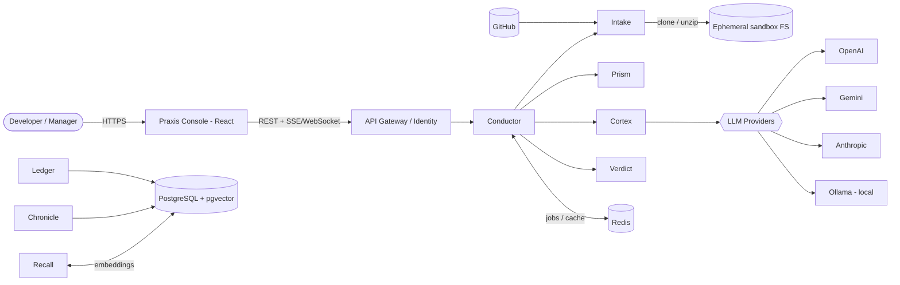
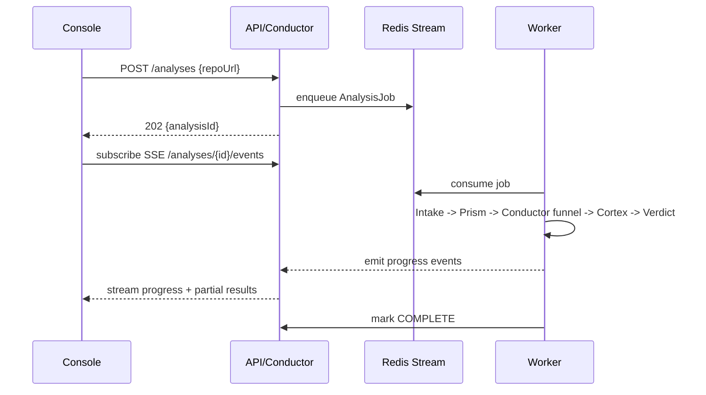

# Praxis — AI-Augmented Code Intelligence Platform

> **Tagline:** *Beyond "what's wrong" — the why, and the way forward.*
>
> Praxis pairs deterministic static analysis with LLM reasoning to explain, review, document, and improve codebases. It **complements** SonarQube/PMD/SpotBugs rather than replacing them: those tools tell you *what* rule broke; Praxis tells you *why it matters here, how to fix it, which pattern fits, and how it scales.*

---

## 0. Naming

**Recommended app name: `Praxis`** — Greek for *putting theory into practice*; the whole product is about turning "best practice theory" into concrete, contextual action. Short, ownable, enterprise-credible, not defensive-sounding (unlike "Guardian," which frames the tool as a gatekeeper when it's really a mentor).

Alternatives, by connotation:

| Name | Connotation | Fit |
|---|---|---|
| **Aegis** | Shield / protection | If you want the enterprise "guardian" angle |
| **Lucent / Lumen** | Illumination, revealing the *why* | Fits the "explainability" USP |
| **Cortex** | Intelligence / reasoning | Good, but heavily used in AI branding |
| **Kendra / Ken** | Old English "range of understanding" | Subtle, understated |

The rest of this doc uses **Praxis** and the module names below. Rename freely — module boundaries matter more than the labels.

### Service module naming (bounded contexts)

| Module | Codename | Responsibility (one line) |
|---|---|---|
| Identity & Tenancy | **Identity** | Auth, orgs/teams/users, RBAC, BYOK key vault |
| Ingestion | **Intake** | Fetch/clone/unzip into sandboxed workspace, filter, diff |
| Static Analysis Engine | **Prism** | AST parsing, metrics, pattern/anti-pattern detection, call graph |
| Pipeline Orchestration | **Conductor** | Async job workflow, static→LLM funnel, progress events |
| AI Intelligence | **Cortex** | Provider-agnostic LLM layer, prompt orchestration, model routing |
| Knowledge / RAG | **Recall** | Embeddings + pgvector, semantic code retrieval for chat & cross-file context |
| Scoring | **Verdict** | Aggregate static + AI signals → Repository Health Score & trends |
| Reporting | **Chronicle** | Dashboard API, PDF/Markdown export, run history |
| Usage & Cost | **Ledger** | Token metering, per-tenant budgets/quotas, cost governance |
| Frontend | **Praxis Console** | React UI |

---

## 1. Problem Statement & Value Proposition

Software teams burn disproportionate engineering time on **review, documentation, knowledge transfer, debugging, refactoring, and security validation** — activities that are high-context and don't parallelize well.

Existing static tools (SonarQube, PMD, SpotBugs, Checkstyle) are excellent at deterministic, rule-based detection but are **context-free**: they emit "Cyclomatic complexity is 34 (>15)" without saying *why it's a problem in this class*, *what refactoring applies*, or *what pattern would remove the branching*.

**Praxis's wedge:** deterministic analysis produces cheap, reliable **signals**; the LLM layer turns those signals into **reasoning and remediation**. Static analysis is the *filter*; the LLM is the *explainer/fixer*. This ordering is the core cost and quality lever of the whole system (see §5.2).

---

## 2. Personas & Use Cases

| Persona | Primary job-to-be-done |
|---|---|
| Junior dev / student / bootcamp | Learn *why* code is bad and how seniors would rewrite it |
| Backend / full-stack dev | Pre-PR self-review; catch smells before a human reviewer does |
| Senior dev / reviewer | Offload mechanical review; focus human attention on business logic |
| Architect | Coupling/cohesion maps, pattern audits, refactor/migration planning |
| Eng manager / lead | Repository Health Score trends across teams and time |
| QA / DevOps | Risk hot-spots, complexity-driven test prioritization |
| Open-source contributor | Understand an unfamiliar codebase fast before contributing |

### Core use cases

1. **Pre-PR sanity check** — dev links a branch; Praxis flags a God Object and a complex method, explains the coupling, and returns a refactored snippet + rationale. Clean PR follows.
2. **Legacy onboarding** — new engineer uploads a 5-year-old undocumented module; Praxis generates JavaDoc, identifies Singleton/Factory usage, and produces plain-English summaries of gnarly methods, plus a "start here" reading order.
3. **Migration/refactor planning** — team runs a monolith through Praxis before a microservices split; gets a coupling map, technical-debt hot-spots, and prioritized refactor targets.
4. **Interactive Q&A** — user asks "why is `OrderService` so coupled to `PaymentGateway`?" and gets a RAG-grounded answer citing the actual call sites (this is what forces the **Recall** module).

---

## 3. Scope

### MVP (Phase 1)

**In**
- Input: `.zip` upload + public GitHub repo URL.
- Language: **Java only (8–21)** — deep AST support beats shallow multi-language.
- Static analysis: cyclomatic complexity, LOC, method/class size, coupling/cohesion (best-effort), design-pattern & anti-pattern detection.
- LLM: smell detection, refactoring suggestions, method explanations, JavaDoc generation — **only on statically-flagged targets** (cost discipline from day one).
- Output: web dashboard (file tree + code + issue side-panel), Repository Health Score, per-file breakdown.
- Async processing with live progress; single-tenant-friendly but multi-tenant-ready data model.
- Local-model mode (Ollama) so proprietary code can stay in-infra.

**Out (deferred)**
- Multi-language (Python/Go/JS) — Phase 3; requires per-language parser adapters.
- CI/CD gating (GitHub Actions PR blocking) — Phase 2.
- Auto-commit/push of fixes — long tail; high blast radius.
- Private repo OAuth, org-wide dashboards, SSO/SAML — Phase 2–3.

### Phased roadmap

| Phase | Theme | Key adds |
|---|---|---|
| 1 (MVP) | Analyze one Java repo well | Modules Intake, Prism, Conductor, Cortex, Verdict, Chronicle; Ollama mode |
| 2 | Team SaaS | Private-repo OAuth, incremental/diff analysis, PR webhooks, SSO, org dashboards |
| 3 | Scale & breadth | Multi-language adapters, CI gating, fix-PR generation, fine-tuned/routed models |

---

## 4. System Architecture

### 4.1 System context



### 4.2 Deployment topology (MVP)

Start as a **Spring Modulith (modular monolith)**, *not* microservices. Enforce the module boundaries above as in-process packages with explicit APIs and no cross-module entity leakage. Extract a module to its own service **only** when it hits an independent scaling axis (Prism is CPU-bound; Cortex is I/O/latency-bound — those are the first two candidates to split later).

- **App tier:** Spring Boot (Gradle), stateless, horizontally scalable.
- **Worker tier:** the same jar run in "worker" profile consuming the job queue — parsing and LLM orchestration run here, never on the request thread.
- **PostgreSQL:** primary store + `pgvector` extension for embeddings (one DB for MVP; don't add a dedicated vector DB yet).
- **Redis:** job queue (Redis Streams) + result/response cache + rate-limit counters.
- **Object storage (S3/MinIO):** large artifacts (extracted trees, generated reports).

---

## 5. The Analysis Pipeline (the heart of the system)

### 5.1 Why it must be asynchronous

A single run = clone (seconds–minutes) → parse N files → run M metrics → issue K LLM calls (each 1–30s) → aggregate. This is a **long-running job**, not a request/response. Modelling it synchronously is the #1 mistake to avoid.



State machine per analysis: `QUEUED → FETCHING → PARSING → ANALYZING → SUMMARIZING → SCORING → COMPLETE | FAILED`. Persist it; drive the UI progress bar from it.

### 5.2 Static-analysis-as-a-filter (cost + quality lever)

Do **not** send whole repos to the LLM. The funnel:

1. **Prism** parses everything (cheap, deterministic) and scores each unit (method/class) for risk: high complexity, size, coupling, detected anti-pattern, TODO/FIXME density.
2. **Conductor** selects only units above a risk threshold (or explicitly requested) as LLM candidates.
3. **Cortex** enriches *those* with explanations/refactors.

Effect: on a 2,000-file repo you might send 150 units to the LLM instead of 2,000 — an order-of-magnitude cost reduction with *better* signal (the LLM isn't diluted by trivial code). This funnel is the product's economic moat.

### 5.3 Caching & incrementality

- **Content-hash cache** (Redis + PG): key every LLM result by `sha256(normalizedSource + promptVersion + model)`. Unchanged file + same prompt version ⇒ cache hit, zero cost.
- **Incremental analysis (Phase 2):** on re-runs, diff against the last commit and re-analyze only changed units. This is what makes PR-time analysis fast and cheap.

---

## 6. Module Deep-Dives

### Intake (Ingestion)
- Git clone (shallow, `--depth 1`) or zip extraction into an **ephemeral, per-job sandbox** directory; wiped on completion.
- Guards: max archive size, max file count, max single-file size, zip-bomb detection, clone timeout. You're *parsing* not *executing* code (lower risk than a build server), but still cap resources hard.
- File filter: honor `.gitignore`, drop binaries/`.class`, isolate `.java`. Build the logical file tree here.

### Prism (Static Analysis)
- **Parser:** JavaParser for AST + **SymbolSolver configured with the project classpath** — plain JavaParser can't resolve cross-file types, so coupling/call-graph metrics need the solver (or Eclipse JDT). Set expectations: full type resolution on an un-buildable repo is best-effort.
- **Metrics:** cyclomatic complexity, LOC, method/class size, afferent/efferent coupling, LCOM-style cohesion.
- **Pattern detector:** AST visitors for Singleton (private ctor + static instance), Builder, Factory, Observer; anti-patterns (God Object via size+coupling, long method, feature envy heuristics).
- Output is a normalized **CodeGraph** (units, relationships, metrics) — the shared contract every downstream module consumes.

### Cortex (AI Intelligence)
- **Provider abstraction:** use **Spring AI** (or LangChain4j) so OpenAI, Gemini, Anthropic, and Ollama are swappable behind one interface. Do **not** hand-roll a client per vendor.
  > *Java analogy:* this is the Strategy pattern behind a `ChatModel` interface — like Spring's `JdbcTemplate` abstracting over DB drivers. Swap the impl via config, not code.
- **Model routing:** cheap/local model (Ollama, or a small hosted model) for JavaDoc + simple explanations; frontier model for hard refactors and architectural reasoning. Route by task complexity + tenant tier.
- **Prompt orchestration:** versioned, templated prompts (JavaDoc vs smell-detection vs explain), with the relevant `CodeGraph` slice + retrieved neighbors (from Recall) as context.
- **Resilience:** retries with backoff, per-provider circuit breaker (Resilience4j), structured-output parsing with schema validation, token accounting emitted to Ledger.
- **Privacy mode:** a tenant policy `codeResidency = LOCAL_ONLY` forces routing to Ollama and blocks external providers. This is a **first-class feature**, not a config afterthought — enterprises will not send proprietary source to OpenAI.

### Recall (RAG)
- Embed code units + docstrings; store vectors in `pgvector`. Powers (a) the chat/Q&A feature and (b) cross-file context injection for Cortex ("here are the 5 most related classes").
- Chunk at the semantic unit (method/class), not fixed token windows — AST boundaries give far better retrieval than naive splitting.

### Verdict (Scoring)
- Weighted aggregation of static metrics + AI-detected issue severity → **Repository Health Score** (0–100 / A–F). Keep the formula transparent and versioned; managers will challenge it.
- Persist per-run so **Chronicle** can show trend lines.

### Chronicle (Reporting) & Ledger (Usage)
- Chronicle: dashboard read-APIs, PDF/Markdown export, run history.
- Ledger: token/cost metering per tenant, budgets and quotas, hard-stop when a tenant exceeds spend. Without this, an "enterprise SaaS" bleeds money silently.

---

## 7. Data Model (sketch)

```
Tenant (1)───(N) User
Tenant (1)───(N) Repository
Repository (1)───(N) Analysis
Analysis (1)───(N) FileResult ───(N) IssueFinding {type, severity, staticOrAI, suggestion}
Analysis (1)───(1) HealthScore
Analysis (1)───(N) LlmCall {provider, model, tokensIn/out, costCents, cacheHit}
CodeUnit (1)───(1) Embedding (pgvector)
```

Every finding records `source = STATIC | AI` so the UI can show provenance and users can trust deterministic results differently from generative ones.

---

## 8. Tech Stack Mapping

| Concern | Choice | Note |
|---|---|---|
| Language/framework | Java 21, Spring Boot, Gradle | Plays to your strength; virtual threads (21) help the I/O-heavy Cortex workers |
| Modularity | Spring Modulith | Enforce boundaries now, extract services later |
| Auth | Spring Security + JWT | Add OAuth2 (GitHub) in Phase 2 |
| Persistence | Spring Data JPA + PostgreSQL + pgvector | One store for relational + vectors at MVP |
| Cache / queue | Redis (Streams + cache) | Add RabbitMQ/Kafka only if fan-out grows |
| LLM layer | Spring AI / LangChain4j | Provider-agnostic; OpenAI, Gemini, Anthropic, Ollama |
| AST | JavaParser + SymbolSolver | JDT as fallback for heavy type resolution |
| Frontend | React + Monaco editor | Monaco gives you VS Code-grade code rendering + inline decorations for free |
| Resilience | Resilience4j | Retries, circuit breakers, rate limiters |
| Observability | Micrometer + OpenTelemetry | Trace the pipeline end-to-end; you'll need it to debug latency/cost |

---

## 9. Key Risks & Decisions

1. **Async or bust** — commit to the job/worker model up front; retrofitting async onto a synchronous design is painful.
2. **Cost governance is architecture, not ops** — the static-first funnel, hash caching, model routing, and Ledger budgets are load-bearing. Skipping them makes the product economically unviable.
3. **Type resolution is hard** — be honest that cross-file metrics are best-effort on un-buildable repos; degrade gracefully.
4. **Privacy is a feature** — LOCAL_ONLY (Ollama) mode is likely your strongest enterprise differentiator vs. anything cloud-only.
5. **Modulith first** — resist microservices for a solo/milestone build; premature distribution multiplies your ops surface for zero MVP benefit.
6. **Polyglot fork (your learning goal):** the stack above is 100% Java, and Spring AI/LangChain4j make that fully viable — you'll ship faster staying in one ecosystem. *If* mastering Python AI/ML is an explicit goal of this milestone, the **Cortex** (and later **Recall**) module is the clean seam to run as a Python/FastAPI sidecar behind the same internal contract. Recommendation: **Java-first for cohesion and speed**; carve out a Python Cortex only if the learning objective outweighs the added ops cost.
