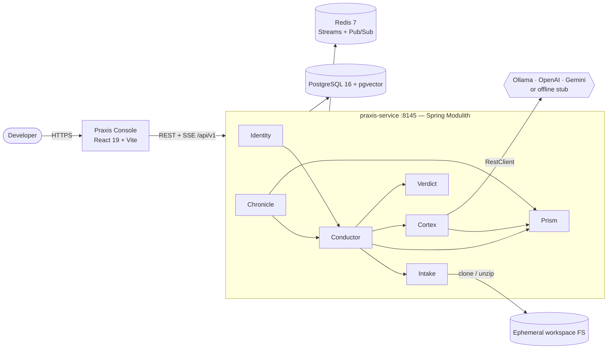
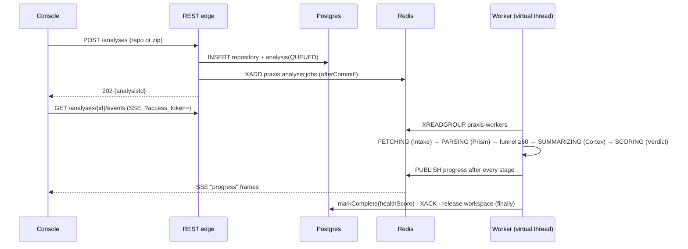

# Praxis — AI-Augmented Code Intelligence Platform

> **Beyond "what's wrong" — the why, and the way forward.**
>
> Praxis pairs deterministic static analysis with LLM reasoning to explain, review, and score Java codebases. Tools like SonarQube tell you *what* rule broke; Praxis tells you *why it matters here and how to fix it* — while a risk funnel keeps LLM cost an order of magnitude lower than "send everything to the model".

    

---

## ⚡ Quick start

Praxis needs three infrastructure services (Postgres, Redis, Ollama) running in Docker; you then run the backend and frontend — **locally** for development, or **in containers** if you just want to use the app. Either way the ports are identical.

**1. Start the infrastructure** (Docker Desktop + Git required):

```bash
git clone <this-repo> && cd Praxis/Docker
docker compose up -d          # postgres · redis · ollama only
```

**2. Run the app** — pick one:

```bash
# A) Locally (for development)
cd ../Backend/praxis-service && ./gradlew bootRun          # API → http://localhost:8145
cd ../Frontend/praxis-console && npm install && npm run dev # UI  → http://localhost:5173

# B) In containers (just to use it)
docker compose --profile app up -d --build                 # UI → http://localhost:5173
```

Open the UI → *Create a workspace* → paste a Java repo URL (e.g. `https://github.com/google/gson.git`) → watch it analyze. No API keys needed (an offline stub reviewer runs by default).

Full details in the [Setup guide](#9-setup-guide-zero-to-running). Component docs: [backend](Backend/praxis-service/README.md) · [frontend](Frontend/praxis-console/README.md).

---

## Table of contents

1. [What it does](#1-what-it-does)
2. [Architecture](#2-architecture)
3. [The analysis pipeline](#3-the-analysis-pipeline)
4. [Modules](#4-modules)
5. [Key design decisions](#5-key-design-decisions)
6. [REST API](#6-rest-api)
7. [Database schema](#7-database-schema)
8. [Configuration reference](#8-configuration-reference)
9. [Setup guide (zero to running)](#9-setup-guide-zero-to-running)
10. [Testing](#10-testing)
11. [Project structure](#11-project-structure)
12. [Troubleshooting](#12-troubleshooting)
13. [Roadmap](#13-roadmap)

---

## 1. What it does

You point Praxis at a **public GitHub repo** or **upload a zip** of Java source. It then:

1. **Fetches** the code into a sandboxed, ephemeral workspace (shallow clone / guarded zip extraction).
2. **Parses** every `.java` file (JavaParser AST) and computes metrics: cyclomatic complexity, LOC, method/class size.
3. **Detects patterns & anti-patterns**: `SINGLETON`, `BUILDER`, `GOD_OBJECT`, `HIGH_COMPLEXITY`, `LONG_METHOD` — each becomes a *STATIC* finding with a severity.
4. **Scores risk** per code unit (method/class) and **funnels only the risky units** (`riskScore ≥ 60`) to the LLM — this is the product's cost lever.
5. **AI-reviews** those units: a senior-reviewer prompt produces an explanation + concrete refactoring per unit (*AI* findings).
6. **Computes a Repository Health Score** (0–100) from findings-per-KLOC + complexity.
7. Streams **live progress over SSE** to a React dashboard: file tree → code viewer with highlighted finding lines → findings panel with AI suggestions.

**Personas:** juniors learning *why* code smells, devs doing pre-PR self-review, architects hunting hot spots, leads tracking health over time.

---

## 2. Architecture

**One deployable Spring Boot JAR** built as a **Spring Modulith** (modular monolith). Module boundaries are real: a module may only call another through its `api` package, enforced by an ArchUnit-backed test (`ModularityTests`) that fails the build on violations.



**Tech stack**

| Layer | Choice | Why |
|---|---|---|
| Backend | Java 21, Spring Boot 4.1, Spring Modulith 2.1, Gradle | Virtual threads for I/O-heavy workers; enforced module seams; extract-to-microservice later only if a scaling axis demands it |
| Persistence | PostgreSQL 16 (`pgvector` image), Flyway, Spring Data JPA | One store for relational + future embeddings; Flyway owns the schema (`ddl-auto: validate`) |
| Async | Redis Streams (job queue, consumer group) + Redis Pub/Sub (progress fan-out) | At-least-once jobs; cross-JVM progress so any web instance can serve the SSE stream |
| LLM | Plain Spring `RestClient` per provider | Version-stable, no framework lock-in; provider chosen by config at startup |
| AST | JavaParser + symbol-solver | Deterministic, fast, testable without any AI |
| Frontend | React 19, Vite, TypeScript (strict), MUI, TanStack Query, Axios, Lucide | Query owns server state (cache/poll/invalidate); Context covers the tiny client state (auth/toast/theme) |

---

## 3. The analysis pipeline

An analysis is a **long-running job**, never a request/response. `POST /analyses` returns `202` in milliseconds; a worker consumes the job from a Redis Stream and drives the state machine:

```
QUEUED → FETCHING → PARSING → ANALYZING → SUMMARIZING → SCORING → COMPLETE | FAILED
```



**Reliability invariants** (all unit-tested):

- **Publish-after-commit** — the job hits Redis only after the DB transaction commits, so a worker can never read a row that isn't there yet.
- **Terminal-status idempotency** — redelivered jobs are no-ops; the `Analysis` aggregate refuses transitions once COMPLETE/FAILED.
- **ACK-in-finally** — a poison message can't loop; failures are recorded on the row, and the message is acknowledged regardless.
- **Workspace-release-in-finally** — fetched code is always deleted, success or failure (including Windows-read-only git pack files).
- **Graceful LLM degradation** — if the provider is unreachable or has no API key, the batch stops and the analysis **completes static-only**; an LLM outage never fails an analysis.

---

## 4. Modules

Each backend module is a package under `com.praxis.*` with `api/` (public), `internal/` (private), and where relevant `web/`, `domain/`, `config/`.

| Module | Status | Responsibility | Notable classes |
|---|---|---|---|
| `identity` | ✅ | Auth & tenancy. Register = tenant + first ADMIN user; stateless JWT (HS256, 60 min). SSE token fallback: `?access_token=` accepted **only** for `/events` URIs | `AuthService`, `JwtService`, `JwtAuthFilter`, `SecurityConfig`; exports `IdentityFacade.currentTenantId()` |
| `intake` | ✅ | Source ingestion into a sandboxed ephemeral workspace. Guards: zip-slip, zip-bomb (ratio > 120), 200 MB / 5000 files / 2 MB-file caps, 120 s clone watchdog, https-only URLs. Also stages multipart uploads (`UploadStore`) with an hourly retention janitor | `SourceFetcherImpl`, `GitRepositoryCloner`, `ZipExtractor`, `JavaFileScanner`, `UploadStoreImpl`, `UploadJanitor` |
| `prism` | ✅ | Static analysis. JavaParser AST → metrics → pattern visitors → risk score (0–100) per method/class. Persists results **including file source text** so the dashboard outlives the deleted workspace | `AstParser`, `MetricCalculator`, `PatternDetector`, `RiskScorer`; exports `StaticAnalyzer`, `FindingWriter`, `AnalysisResultQuery` |
| `conductor` | ✅ | Orchestration: REST endpoints, Redis Stream worker, the state machine, the **risk funnel** (`riskScore ≥ praxis.analysis.risk-threshold`), SSE registry | `AnalysisOrchestrator`, `AnalysisPipeline`, `AnalysisWorker`, `SseEmitterRegistry`; exports `AnalysisQuery` |
| `cortex` | ✅ | LLM layer. One `LlmClient` selected at startup by `praxis.cortex.provider`: `stub` (default, offline) · `ollama` · `openai` · `gemini`. Real token counts recorded per call in `llm_call` | `CortexService`, `AbstractHttpLlmClient`, `OllamaLlmClient`, `OpenAiLlmClient`, `GeminiLlmClient`, `StubLlmClient` |
| `verdict` | ✅ | Health score v1 (versioned formula): `clamp(100 − (crit×8 + maj×3 + min×1)/KLOC − min(20,(avgCx−5)×2))` | `HealthScorerImpl` |
| `chronicle` | ✅ | Dashboard read-side (owns no data): run history, file tree, file detail. Ownership failures are 404 — existence is never leaked | `DashboardController` |
| `recall` | 🔜 | RAG: embed code units into pgvector; grounded chat Q&A (Phase 2) | placeholder |
| `ledger` | 🔜 | Cost governance: per-tenant budgets, price book, hard stop on overspend (Phase 2). `llm_call` rows are already written by Cortex | placeholder |
| `common` | ✅ | Open shared kernel: `ApiError{code,message,traceId}`, `ApiException`, global handler, `SourceType` | `GlobalExceptionHandler` |

**Frontend (`Frontend/praxis-console`)** — ✅ React 19 + TS strict. Pages: Login/Register, Analyses history, New Analysis (GitHub tab + drag-drop zip upload), Analysis (live SSE stepper → 3-panel dashboard: FileTree | CodeViewer with severity-highlighted lines | FindingsPanel with expandable AI suggestions). Server state via TanStack Query; SSE with 3 s polling fallback; light/dark theme.

---

## 5. Key design decisions

- **Static-analysis-as-a-filter.** Prism grades every unit deterministically and cheaply; only units at/above the risk threshold reach the LLM. On a 2,000-file repo that's ~150 LLM calls instead of 2,000 — the economics of the whole product.
- **Modulith first, microservices maybe never.** Boundaries are enforced *now* (build fails on violations); extraction later is a deployment decision, not a rewrite.
- **The queue carries IDs, the DB carries truth.** Redis jobs are `{analysisId, tenantId}` only; workers reload state, so redelivery is always safe.
- **Tenant scoping is code, not convention.** Every read goes through `findByIdAndTenantId(...)`; the tenant comes from the JWT via `IdentityFacade`, never from a request body.
- **No Spring AI dependency.** Providers are one small `LlmClient` implementation each over `RestClient` — swapping/adding a provider is one class + one config value (`@ConditionalOnProperty`).
- **Findings record provenance.** Every finding is `STATIC` or `AI`, so the UI can present deterministic results differently from generative ones.

---

## 6. REST API

Base: `http://localhost:8145/api/v1`. All endpoints except `/auth/**` and `/actuator/health` require `Authorization: Bearer <JWT>`.

| Method | Path | Body / params | Returns |
|---|---|---|---|
| POST | `/auth/register` | `{email, password≥8, tenantName}` | `{token, tokenType}` — creates tenant + ADMIN user |
| POST | `/auth/login` | `{email, password}` | `{token, tokenType}` (JWT, 60 min) |
| POST | `/analyses` | `{name, sourceType: GITHUB\|ZIP, sourceRef}` | `202 {analysisId, status}` |
| POST | `/analyses/upload` | multipart: `file` (.zip ≤ 200 MB), `name?` | `202 {analysisId, status}` |
| GET | `/analyses` | — | `AnalysisSummary[]` (tenant history) |
| GET | `/analyses/{id}` | — | `{id, status, healthScore, errorMessage, …}` |
| GET | `/analyses/{id}/events` | SSE; auth via `?access_token=<JWT>` | `progress` events `{status, message, at}`; closes on terminal |
| GET | `/analyses/{id}/files` | — | `[{fileResultId, path, loc, complexity, findingCount}]` |
| GET | `/analyses/{id}/files/{fileResultId}` | — | `{path, source, findings[{type, severity, source, message, suggestion, startLine, endLine}]}` |

Errors are always `{code, message, traceId}` with a proper HTTP status (e.g. `EMAIL_ALREADY_REGISTERED` 409, `INVALID_CREDENTIALS` 401, `ANALYSIS_NOT_FOUND` 404, `UNSUPPORTED_FILE_TYPE`/`EMPTY_UPLOAD`/`UPLOAD_TOO_LARGE` 400, `VALIDATION_ERROR` 400).

---

## 7. Database schema

Flyway-managed (`Backend/praxis-service/src/main/resources/db/migration`). `V1__init.sql` creates all tables; `V2__analysis_results.sql` adds `file_result.source` + indexes.

```
tenant ──< app_user
tenant ──< repository ──< analysis ──< file_result ──< code_unit ──< issue_finding
                          analysis ──< llm_call            code_unit ── embedding (Phase 2)
```

| Table | Owner | Highlights |
|---|---|---|
| `tenant`, `app_user` | identity | email globally unique; role ADMIN/MEMBER; `code_residency` reserved for LOCAL_ONLY routing |
| `repository`, `analysis` | conductor | `analysis.status` = the state machine; `health_score`; `prompt_version` |
| `file_result` | prism | per-file metrics **+ full source text** (dashboard renders after workspace deletion) |
| `code_unit` | prism | CLASS/METHOD, line range, `source_hash` (sha-256), `risk_score` (the funnel input) |
| `issue_finding` | prism | `source` = STATIC \| AI; `suggestion` = LLM refactoring text |
| `llm_call` | cortex (→ ledger later) | provider, model, real token counts, cost placeholder |
| `embedding` | recall (Phase 2) | `vector(768)` — pgvector |

---

## 8. Configuration reference

Everything reads from env vars with dev-friendly defaults (`Backend/praxis-service/src/main/resources/application.yaml`). **The committed defaults (DB password, JWT secret) are for local dev only — always override them outside your machine.**

| Env var | Default | Meaning |
|---|---|---|
| `DB_URL` / `DB_USER` / `DB_PASSWORD` | localhost:5432 `praxis_db` | Postgres connection |
| `REDIS_HOST` / `REDIS_PORT` | localhost:6379 | Redis |
| `JWT_SECRET` | dev value | HS256 signing key — **≥ 32 bytes** |
| `CORTEX_PROVIDER` | `stub` | `stub` (offline, no keys) · `ollama` · `openai` · `gemini` |
| `OLLAMA_BASE_URL` / `OLLAMA_MODEL` | localhost:11434 / `qwen2.5-coder:7b` | local LLM |
| `OPENAI_API_KEY` / `OPENAI_MODEL` | — / `gpt-4o` | OpenAI |
| `GEMINI_API_KEY` / `GEMINI_MODEL` | — / `gemini-1.5-pro` | Google Gemini |
| `INTAKE_WORKSPACE_ROOT` | `${tmp}/praxis-workspaces` | ephemeral fetch sandbox |

App-tuning keys under `praxis.*`: `analysis.risk-threshold` (60 — the funnel), `prism.*` (detector thresholds: complexity 10, long method 60 LOC, god object 20 methods/400 LOC), `intake.*` (all safety caps + `allowed-upload-extensions`, `upload-retention-hours`), `cortex.*` (provider blocks, `temperature: 0.2`, `prompt-version`).

---

## 9. Setup guide (zero to running)

The model is simple: **infrastructure always runs in Docker; the app (backend + frontend) you run either locally or in containers — the ports are the same in both**, so you never juggle two sets of URLs and you never run the same service twice.

| Service | Port | Runs in |
|---|---|---|
| Frontend (UI) | **5173** | local `npm run dev` **or** container |
| Backend (API) | **8145** | local `bootRun` **or** container |
| PostgreSQL | 5432 | Docker (always) |
| Redis | 6379 | Docker (always) |
| Ollama | 11434 | Docker (always) |

### Prerequisites

- **Docker Desktop** and **Git** — always.
- For running the app locally: **JDK 21** and **Node 20+**.
- For real AI (optional): a pulled Ollama model or an OpenAI/Gemini key. Without either, the offline stub reviewer runs — no keys needed.

### Step 1 — start the infrastructure (always)

```bash
cd Docker
docker compose up -d        # postgres · redis · ollama only
```

That's all the default `up` does — no app containers, so your local ports (8145, 5173) stay free.

### Step 2 — run the app

**Option A — locally (for development):**

```bash
# backend
cd Backend/praxis-service
./gradlew bootRun            # API → http://localhost:8145

# frontend (new terminal)
cd Frontend/praxis-console
npm install && npm run dev   # UI → http://localhost:5173
```

**Option B — in containers (just to use the app):**

```bash
cd Docker
docker compose --profile app up -d --build      # UI → http://localhost:5173, API → :8145
# or one at a time:
docker compose --profile app up -d backend
docker compose --profile app up -d frontend
```

> **Don't mix A and B for the same service** — they share the port on purpose. If a container already holds 8145/5173, stop it (`docker compose --profile app down`) before running that service locally, and vice-versa. This is exactly what prevents the "port already in use" confusion.

### Step 3 — first analysis (2 minutes)

1. Open **http://localhost:5173** → **Create a workspace** (registers your tenant + admin user).
2. **New analysis** → GitHub tab → paste a small public Java repo, e.g. `https://github.com/google/gson.git` (or use the **Upload zip** tab).
3. Watch the pipeline stepper stream live (QUEUED → … → SCORING).
4. On COMPLETE: health score badge, file tree (badges = finding counts), click a badged file → code with highlighted lines, findings on the right — expand an AI finding for the model's suggestion.

### Choosing the LLM (optional)

The backend picks its engine from `CORTEX_PROVIDER` (default `stub` — an offline reviewer, no model, no keys). There is **no auto-fallback**: if a real provider is unreachable/keyless, analyses still complete but **static-only**, never faking it with the stub.

- **Stub (default):** nothing to do.
- **Local model (Ollama):** pull once (`OLLAMA_MODEL` overrides the default `qwen2.5-coder:7b`, ~4.7 GB), then run the backend with the ollama provider:
  ```bash
  docker compose --profile model up ollama-coder            # one-shot pull helper
  # (equivalent: docker compose exec ollama ollama pull qwen2.5-coder:7b)
  # local:      CORTEX_PROVIDER=ollama ./gradlew bootRun
  # container:  CORTEX_PROVIDER=ollama docker compose --profile app up -d --build backend
  ```
- **Cloud (OpenAI / Gemini):** no download — set the provider + key, e.g. `CORTEX_PROVIDER=openai OPENAI_API_KEY=sk-...` before the run command above.

Confirm which engine answered:
```bash
docker exec praxis-pgdb psql -U praxis_user -d praxis_db \
  -c "SELECT provider, model FROM llm_call ORDER BY created_at DESC LIMIT 3;"
# STUB = offline reviewer · OLLAMA / OPENAI / GEMINI = a real model ran
```

### Stop / reset

```bash
docker compose --profile app down      # stop everything (keep data)
docker compose down -v                  # also wipe DB / Redis / Ollama volumes (clean slate)
```

> Tip: put `DB_PASSWORD`, `JWT_SECRET`, `CORTEX_PROVIDER`, and any API keys in a `Docker/.env` file so you don't repeat them on the command line.
>
> **Hot reloading inside containers** is documented (commented) at the bottom of `Docker/docker-compose.yml`.

---

## 10. Testing

```bash
cd Backend/praxis-service
./gradlew test
```

- **Pure unit tests** (no Spring/DB/network): Prism metrics & detectors against tiny Java snippets, RiskScorer math, Verdict formula, Cortex batching/degradation with a mocked client, Intake zip-slip/zip-bomb/workspace lifecycle, upload store & janitor.
- **`ModularityTests`** — Spring Modulith boundary verification; the build fails if any module touches another's internals.
- **`PraxisServiceApplicationTests`** — context boot (needs the dockerized Postgres/Redis running).

Frontend: `npm run build` runs `tsc` in strict mode as the type gate.

---

## 11. Project structure

```
Praxis/
├── Backend/praxis-service/          # the Spring Modulith (one JAR)
│   ├── Dockerfile                   # multi-stage: JDK build → JRE runtime (non-root)
│   └── src/main/java/com/praxis/
│       ├── identity/ intake/ prism/ conductor/ cortex/ verdict/ chronicle/
│       ├── recall/ ledger/          # Phase-2 placeholders
│       └── common/                  # shared kernel
├── Frontend/praxis-console/         # React 19 + Vite + TS (has its own README)
│   ├── Dockerfile                   # multi-stage: Node build → nginx serve + /api proxy
│   └── nginx.conf                   # SPA fallback + SSE-friendly reverse proxy
├── Docker/docker-compose.yml        # infra by default; app via --profile app (see §9)
├── Documentations/                  # HLD, LLD, architecture spec, praxis-flow-map.html (living diagram)
└── test-samples/                    # guaranteed-risky sample zip + scripted LLM smoke test
```

Each implemented backend module also carries a `<module>.md` design doc next to its code.

---

## 12. Troubleshooting

| Symptom | Cause & fix |
|---|---|
| Startup: no Flyway logs, tables look wrong | Spring Boot 4 needs the `spring-boot-flyway` module on the classpath (already in `build.gradle`) — if you fork the build, keep it, or Flyway silently never runs |
| Startup: `Found non-empty schema … without schema history table` | Your DB predates Flyway ownership. Dev fix: `docker exec praxis-pgdb psql -U praxis_user -d praxis_db -c "DROP SCHEMA public CASCADE; CREATE SCHEMA public;"` and restart |
| SSE dies with `AuthorizationDeniedException` after completion | Async/error dispatches must stay `permitAll` in `SecurityConfig` (already handled) — don't tighten `dispatcherTypeMatchers` |
| EventSource gets 401 | Browsers can't set headers on SSE — the token must ride as `?access_token=` (only honored for `/events` URIs) |
| Workspace cleanup fails on Windows (`AccessDeniedException` on `.pack`) | Git marks pack files read-only; `WorkspaceManager` clears the DOS flag and retries (already handled) |
| Analysis COMPLETE but zero AI findings | Either the funnel selected no units (code too clean — try `test-samples/nasty-sample.zip`) or the provider was down/keyless and the run degraded to static-only (check logs) |
| Backend can't reach Ollama | The compose service maps `11434:11434`; if you run the backend in Docker too, use the service name, not `localhost` |
| `NO .java files found` failure | The zip/repo genuinely contains no Java sources — that's a deliberate hard failure |

---

## 13. Roadmap

1. **LLM response cache + resilience** — Redis cache keyed `sha256(source + promptVersion + model)` (`cache_hit` flag exists), Resilience4j retry/circuit-breaker, provider price book → real `cost_cents`.
2. **Recall** — pgvector embeddings per code unit; grounded chat Q&A over your codebase.
3. **Ledger** — per-tenant budgets and hard stops; takes ownership of `llm_call`.
4. **Hardening** — env-only secrets, CORS config, user invites, `XAUTOCLAIM` reclaim for crashed workers, Markdown/PDF report export, `code_residency=LOCAL_ONLY` forcing Ollama-only routing.

Deeper reading: `Documentations/Praxis-Architecture-Spec.md` (the why), `Documentations/LLD-README.md` (the how), and `Documentations/praxis-flow-map.html` — a living visual map of every flow, kept in sync with the code.
